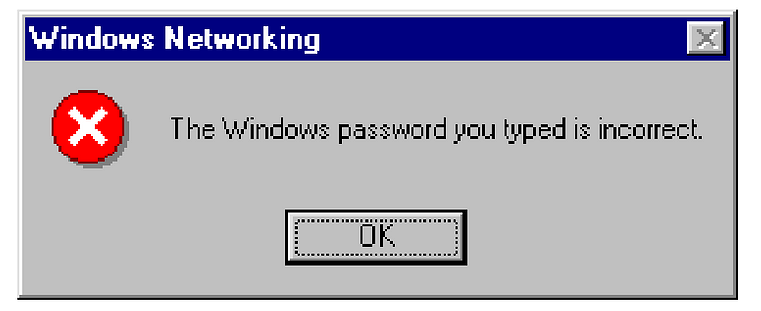

# Potential tasks

This is a list of tasks I haven't had the time to get to.

## The ugly

1. I'd rather not make it a SPA. It's not my default choice
   these days. Plus it requires
   [hacks](https://github.com/rafgraph/spa-github-pages) to
   be deployed to GH pages.

   Ideally a login form should be able to work with JS
   disabled, by submitting a POST request and getting a
   cookie on success. As an example,
   [karkar.flpvsk.com](https://karkar.flpvsk.com) uses that
   technique.

   I was hoping to use the Preact prerender to at least make
   it an SSR, but it's failing with an obscure error
   (`window is not defined`). I'm suspecting the error is
   caused by a third-party dependency of the project:
   [Zod](https://zod.dev/). I'm using it for validation.

   One way to make it Server-Sider-Render-able might be to
   either fix Zod or to remove it all together.

## The bad

1. The site needs a favicon.

2. The custom checkbox needs work and testing on multiple
   devices.

## The nice-to-have

1. If an anonymous user lands on a page other than `/login`,
   would be nice to pass the location of the landing page to
   a query paramater and redirect the user there after
   logging in.

   E.g. an anonymous user lands on `/protected-page`, the
   site redirects them to `/login?redirect=protected-page`
   to log in. After they log in, they land on
   `/protected-page`.

2. I'd love to find and use that classic red error icon for
   server errors :)

   
